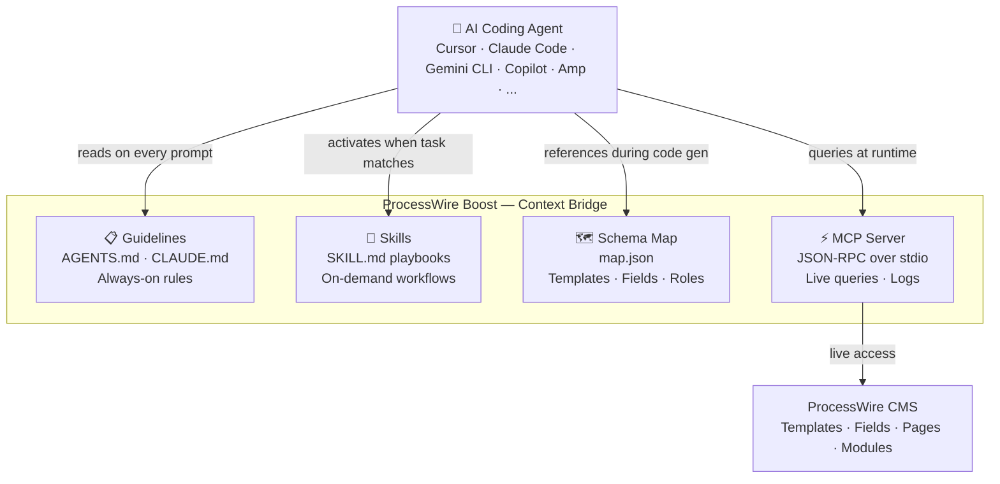
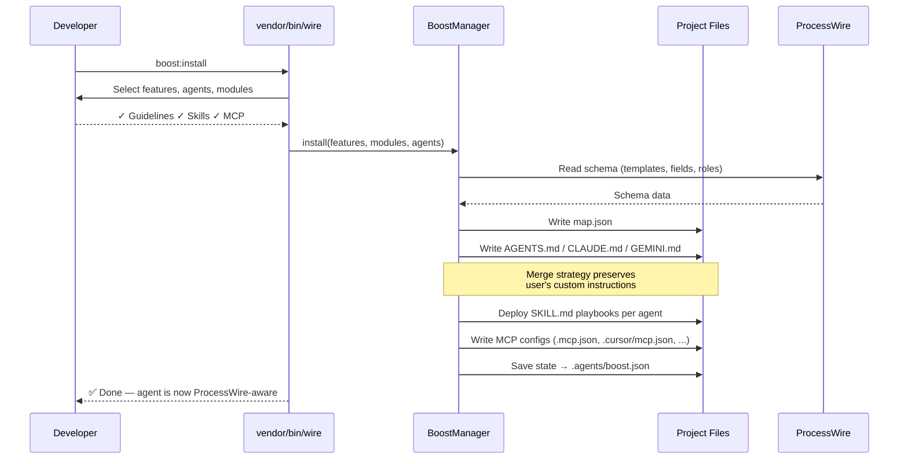
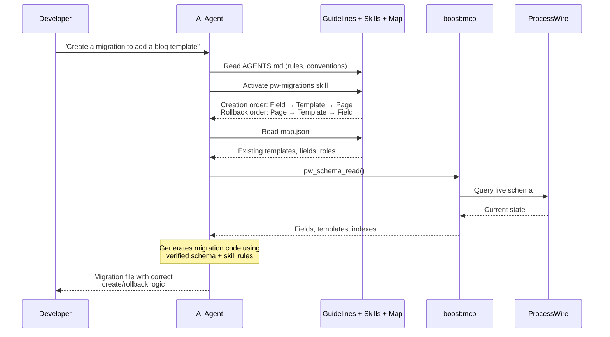

<p align="center">
  
  
  
</p>

# ProcessWire Boost

**AI context bridge for ProcessWire CMS/CMF.**

Boost ensures AI coding agents produce expert-level ProcessWire code by providing structured context: guidelines that encode best practices, task playbooks (skills) that teach specific patterns, a schema map for project awareness, and a JSON-RPC (MCP) server for live system access.

This is **not** a CLI tool collection — Boost is a knowledge layer. It sits between your ProcessWire project and the AI agent, ensuring every code suggestion, module scaffold, and schema change follows established conventions.

---

## Table of Contents

- [Why Boost?](#why-boost)
- [How It Works](#how-it-works)
- [Requirements](#requirements)
- [Installation](#installation)
- [Quick Start](#quick-start)
- [Context Layers](#context-layers)
  - [Guidelines](#guidelines)
  - [Skills (Task Playbooks)](#skills-task-playbooks)
  - [Schema Map](#schema-map)
  - [MCP Server (Live Access)](#mcp-server-live-access)
- [Agent System](#agent-system)
- [Module Integration](#module-integration)
- [Commands](#commands)
- [Configuration](#configuration)
- [Troubleshooting](#troubleshooting)
- [License](#license)

---

## Why Boost?

AI agents can write PHP — but writing *correct ProcessWire code* requires deep context:

| Without Boost | With Boost |
|---------------|------------|
| Agent guesses API methods, often hallucinating | Guidelines provide verified API patterns with version-specific signatures |
| Agent uses raw SQL or incorrect selectors | `pw-pages` skill teaches operator syntax, sanitization, and performance rules |
| Agent creates fields/templates manually | `pw-migrations` skill guides the agent through safe, versioned schema changes |
| Agent has no idea what templates or fields exist | `map.json` provides a complete schema snapshot — no guessing |
| Agent cannot inspect live data | MCP server exposes real-time queries, logs, and module info |

**Boost turns a general-purpose AI into a ProcessWire specialist.**
## How It Works

### Architecture



**Four context layers**, each serving a different purpose:

| Layer | Format | Purpose | When Used |
|-------|--------|---------|-----------| 
| **Guidelines** | Markdown in agent config | Encode rules, conventions, API patterns | Every prompt — always-on context |
| **Skills** | `SKILL.md` playbooks | Teach step-by-step workflows | On-demand — agent activates when task matches |
| **Schema Map** | `map.json` | Project-specific templates, fields, roles | Code generation — agent knows what exists |
| **MCP Server** | JSON-RPC over stdio | Live queries, logs, module info | Runtime — agent inspects real data |

### Install Flow



### Runtime Flow



---

## Requirements

| Dependency | Version |
|------------|---------|
| PHP | `>= 8.3` |
| ProcessWire | `3.x` |
| [processwire-console](https://github.com/trk/processwire-console) | `dev-main` (peer dependency) |

---

## Installation

```bash
composer require trk/processwire-boost --dev
```

> **Note:** `processwire-console` provides the `vendor/bin/wire` CLI runner. Boost commands are auto-discovered via Composer `extra` metadata — no manual registration needed.

---

## Quick Start

### 1. Run the Installer

```bash
# Interactive mode — prompts for features, agents, and modules
php vendor/bin/wire boost:install

# Flag mode — skip prompts
php vendor/bin/wire boost:install \
  --guidelines --skills --mcp \
  --agents="Cursor,Claude Code,Gemini CLI" \
  --modules="Htmx,FieldtypeAiAssistant"
```

### 2. What Gets Generated

```
project-root/
├── AGENTS.md                    # Universal guidelines (Cursor, Codex, Amp, etc.)
├── CLAUDE.md                    # Claude Code specific guidelines
├── GEMINI.md                    # Gemini CLI specific guidelines
├── .mcp.json                    # Claude Code MCP config
├── .cursor/
│   ├── mcp.json                 # Cursor MCP config
│   └── skills/                  # Cursor skill playbooks
│       ├── pw-pages/SKILL.md
│       ├── pw-module-development/SKILL.md
│       └── ...
├── .claude/skills/              # Claude Code skill playbooks
├── .junie/
│   ├── mcp/mcp.json             # Junie MCP config (absolute paths)
│   └── skills/
├── .trae/
│   ├── mcp.json                 # Trae MCP config (${workspaceFolder} paths)
│   └── rules/                   # Trae skill playbooks (YAML frontmatter)
├── .vscode/mcp.json             # GitHub Copilot MCP config
├── .github/skills/              # GitHub Copilot skill playbooks
└── .agents/
    ├── boost.json               # Installation state
    ├── map.json                  # Schema snapshot (templates, fields, roles)
    └── skills/                  # Central skill staging area
```

### 3. Verify

```bash
# Check installation state
cat .agents/boost.json

# Verify skills were deployed
ls .cursor/skills/

# Test MCP server
echo '{"jsonrpc":"2.0","id":1,"method":"tools/list"}' | php vendor/bin/wire boost:mcp
```

---

## Context Layers

### Guidelines

Guidelines are the **always-on context layer** — they are compiled into a single instruction block and embedded in the agent's primary instruction file (e.g., `AGENTS.md`, `CLAUDE.md`).

Every time the agent processes a prompt, it reads these rules. This is where conventions, security patterns, and API usage rules live.

#### What Gets Compiled

| Section | Content |
|---------|---------|
| **Foundation** | System identity, PHP/PW version binding, installed module roster, skill activation menu |
| **Boost** | CLI & MCP tool reference, dual MCP integration patterns |
| **PHP** | Strict typing, constructor promotion, PHPDoc, enums, array shapes |
| **ProcessWire Core** | API variables (`$pages`, `$fields`, `$users`, `$input`, `$config`, `$sanitizer`) |
| **ProcessWire Development** | Hook system (`addHookBefore`/`addHookAfter`), module types, namespaces |
| **ProcessWire Security** | Input sanitization, RBAC (`hasRole`, `hasPermission`, `editable`), CSRF tokens |
| **ProcessWire Selectors** | Query syntax, operators, `limit=`, indexed field priority, `selectorValue()` |

#### Source Priority

1. **Core** — `resources/boost/guidelines/*.md` (7 files)
2. **Module** — `{module}/.agents/guidelines/*.md` (third-party modules)
3. **Fallback** — `{module}/AGENTS.md` (if no guidelines directory exists)

#### Merge Strategy

| File State | Behavior |
|------------|----------|
| File has `<processwire-boost-guidelines>` tags | Replace content between tags only — your custom instructions are preserved |
| File exists, no tags | Append tags after existing content |
| File doesn't exist | Create from scratch with header |

This means your custom instructions in `CLAUDE.md` or `AGENTS.md` survive across reinstalls.

---

### Skills (Task Playbooks)

Skills are **on-demand context** — the agent activates a specific skill when the current task matches its domain. Each skill is a `SKILL.md` file containing a complete workflow guide.

Unlike guidelines (which are always present), skills are loaded only when relevant. This keeps the context window efficient while providing deep expertise when needed.

#### Built-in Skills (12)

| Skill | What It Teaches the Agent |
|-------|--------------------------|
| `pw-api-variables` | How to safely access `$pages`, `$user`, `$config` in templates, modules, and hooks |
| `pw-custom-page-classes` | Building strongly-typed Page subclasses bound to specific templates |
| `pw-pages` | The complete lifecycle: find → create → edit → save → trash → delete |
| `pw-migrations` | Safe, versioned schema changes: field → template → page creation order, rollback guards |
| `pw-module-development` | Native module architecture: `init()`, `ready()`, config, install/uninstall lifecycle |
| `pw-module-fieldtype-inputfield` | Custom database fieldtypes and their corresponding input UI components |
| `pw-module-filevalidator` | File upload validation, security normalization, MIME checking |
| `pw-module-markup` | Frontend rendering systems using the ProcessWire Markup module pattern |
| `pw-module-process` | Admin page pipelines, dashboards, routing, and RBAC within ProcessWire admin |
| `pw-module-textformatter` | String formatting modules that transform field output at render time |
| `pw-pages` | Complete selector language reference: operators, sub-selectors, OR-groups, pagination |
| `pw-url-routing` | URL/Path hooks for REST APIs, virtual pages, and custom endpoints |

#### Module-Provided Skills

Third-party ProcessWire modules can ship their own Boost skills. When selected during `boost:install`, these are merged alongside the built-in skills:

| Module | Skill | What It Teaches the Agent |
|--------|-------|--------------------------|
| `Totoglu\Htmx` | `pw-htmx` | HTMX components, swaps, OOB fragments, and state management |

#### How Skills Guide Agents

When an agent encounters a task like "create a migration to add a blog template", the `pw-migrations` skill activates and provides:

- Correct creation order: Field → Fieldgroup → Template → Page
- Safe rollback order: Page → Template → Fieldgroup → Field
- Pre-flight safety checks (e.g., "don't delete a field that's still attached to templates")
- Working stub selection (`--type=create-template`)

Without this skill, the agent would guess at the API and likely produce unsafe or incorrect migration code.

#### Agent-Specific Formats

| Agent | Skill Format |
|-------|-------------|
| **OpenCode** | YAML frontmatter (`name`, `description`, `license`, `compatibility`) prepended |
| **Trae** | YAML frontmatter wrapping, deployed to `.trae/rules/` |
| **All others** | Plain Markdown `SKILL.md` in `{skillName}/SKILL.md` structure |

---

### Schema Map

The schema map (`map.json`) gives agents **project-specific awareness** without requiring a live database connection.

Generated on every `boost:install` run, it contains:

| Section | Content |
|---------|---------|
| **Templates** | Names, IDs, and assigned field lists |
| **Fields** | Names, IDs, fieldtype class names, and labels |
| **Modules** | Installed modules with titles and versions |
| **Roles** | Names, IDs, and assigned permissions |
| **Permissions** | Names, IDs, and titles |

This map enables agents to:
- Generate code that references **real template and field names** instead of placeholders
- Avoid creating duplicate fields or templates
- Understand the permission structure before creating access control logic

---

### MCP Server (Live Access)

The MCP server provides **real-time access** to the running ProcessWire system via JSON-RPC over stdio.

This is the most powerful context layer — it enables agents to inspect live data, run selectors against real pages, read logs, and manage modules without leaving the conversation.

#### Available Tools (28)

| Category | Tools | Safety |
|----------|-------|--------|
| **Schema** | `pw_schema_read`, `pw_schema_field_create`, `pw_schema_template_create` | Read + ⚠️ Write |
| **Query** | `pw_query`, `pw_execute` | Read + ⚠️ Guarded |
| **Modules** | `pw_module_list`, `pw_module_info`, `pw_module_install`, `pw_module_uninstall`, `pw_module_enable`, `pw_module_disable`, `pw_module_refresh`, `pw_module_upgrade` | Read + ⚠️ Write |
| **Access** | `pw_access_user_list`, `pw_access_user_create`, `pw_access_user_update`, `pw_access_user_delete`, `pw_access_role_create`, `pw_access_role_grant`, `pw_access_role_revoke`, `pw_permission_delete` | Read + ⚠️ Write |
| **System** | `pw_system_get_logs`, `pw_system_logs_tail_last`, `pw_system_logs_clear`, `pw_system_cache_clear`, `pw_system_cache_wire_clear` | Read + ⚠️ Write |
| **Backup** | `pw_system_backup`, `pw_system_backup_list`, `pw_system_backup_purge`, `pw_system_restore` | ⚠️ Write |

#### MCP Config Formats

Boost auto-generates MCP configuration in each agent's native format during `boost:install`:

**JSON — Relative paths** (Cursor, Claude Code, Copilot, Amp):
```json
{
  "mcpServers": {
    "processwire": {
      "command": "php",
      "args": ["vendor/bin/wire", "boost:mcp"]
    }
  }
}
```

**JSON — Absolute paths** (Gemini CLI, Junie):
```json
{
  "mcpServers": {
    "processwire": {
      "command": "/opt/homebrew/bin/php",
      "args": ["/Users/you/project/vendor/bin/wire", "boost:mcp"]
    }
  }
}
```

**JSON — ${workspaceFolder}** (Trae):
```json
{
  "mcpServers": {
    "processwire": {
      "command": "php",
      "args": ["${workspaceFolder}/vendor/bin/wire", "boost:mcp"]
    }
  }
}
```

**TOML** (Codex):
```toml
[mcp_servers.processwire]
command = "php"
args = ["vendor/bin/wire", "boost:mcp"]
```

**OpenCode** (nested command array):
```json
{
  "$schema": "https://opencode.ai/config.json",
  "mcp": {
    "processwire": {
      "type": "local",
      "enabled": true,
      "command": ["php", "vendor/bin/wire", "boost:mcp"]
    }
  }
}
```

---

## Agent System

Boost uses a polymorphic `Agent` class hierarchy. Each agent declares how it wants to receive context:

| Method | Purpose |
|--------|---------|
| `guidelinesPath()` | Where the agent reads its instruction file |
| `skillsPath()` | Where task playbooks are deployed |
| `mcpPathStrategy()` | How MCP paths are resolved (`Relative`, `Absolute`, `WorkspaceFolder`) |
| `mcpConfigPath()` | Where MCP server configuration is written |
| `exportSkill()` | How to format skills (override for YAML frontmatter, etc.) |

### Supported Agents

| Agent | Guidelines | Skills | MCP Config | Path Mode |
|-------|-----------|--------|------------|-----------|
| **Amp** | `AGENTS.md` | `.agents/skills` | `.amp/settings.json` | `Relative` |
| **Claude Code** | `CLAUDE.md` | `.claude/skills` | `.mcp.json` | `Relative` |
| **Codex** | `AGENTS.md` | `.agents/skills` | `.codex/config.toml` | `Relative` |
| **Cursor** | `AGENTS.md` | `.cursor/skills` | `.cursor/mcp.json` | `Relative` |
| **Gemini CLI** | `GEMINI.md` | `.agents/skills` | `.gemini/settings.json` | `Absolute` |
| **GitHub Copilot** | `AGENTS.md` | `.github/skills` | `.vscode/mcp.json` | `Relative` |
| **Junie** | `AGENTS.md` | `.junie/skills` | `.junie/mcp/mcp.json` | `Absolute` |
| **OpenCode** | `AGENTS.md` | `.agents/skills` | `opencode.json` | `Relative` |
| **Trae** | `AGENTS.md` | `.trae/rules` | `.trae/mcp.json` | `WorkspaceFolder` |

> **Auto Path Resolution:** Each agent declares its `mcpPathStrategy()` via the `McpPathStrategy` enum. No manual configuration needed — paths are resolved automatically.

### Adding a Custom Agent

```php
<?php

declare(strict_types=1);

namespace Your\Namespace;

use Totoglu\Console\Boost\Install\Agents\Agent;

final class MyAgent extends Agent
{
    public function name(): string { return 'my_agent'; }
    public function displayName(): string { return 'My Agent'; }
    public function mcpConfigPath(): ?string { return '.my-agent/mcp.json'; }
    public function guidelinesPath(): string { return 'AGENTS.md'; }
}
```

---

## Module Integration

Third-party ProcessWire modules can expose their own guidelines and skills to Boost.

### Directory Structure

```
site/modules/YourModule/
└── .agents/
    ├── guidelines/
    │   └── your-module-rules.md
    └── skills/
        └── your-module-skill/
            └── SKILL.md
```

### Discovery

1. Boost scans `site/modules/` and `wire/modules/` for `.agents/` directories
2. Guidelines from `.agents/guidelines/*.md` are compiled into the agent instruction file
3. Skills from `.agents/skills/*/SKILL.md` are deployed alongside core skills
4. Fallback: if no `.agents/guidelines/` exists, `AGENTS.md` in the module root is used

> **Tip:** After installing a new module that provides Boost skills, run `php vendor/bin/wire boost:update` to sync the new guidelines and skills into your workspace.

### Site-Level Overrides

```
site/boost/
├── guidelines/    # Project-specific guidelines
└── skills/        # Project-specific skills
```

---

## CLI Commands

### `boost:install`

Manage AI helper setup (ProcessWire Boost). Select features to install/update, deselect to remove.

**Usage:**
```bash
wire boost:install [options]
```

**Options:**
| Option | Short | Default | Description |
|--------|-------|---------|-------------|
| `--guidelines` | | `false` | Install AI Guidelines |
| `--skills` | | `false` | Install Agent Skills |
| `--mcp` | | `false` | Install MCP Server Configuration |
| `--modules` | `-m` | `null` | Comma-separated modules to install |
| `--agents` | `-a` | `null` | Comma-separated agents to configure |

**Examples:**
```bash
# Interactive installation
wire boost:install

# Flag-based non-interactive installation
wire boost:install --guidelines --skills -a "Cursor,Claude Code" -m "Htmx"
```

### `boost:update`

Re-sync ProcessWire Boost guidelines & skills from saved configuration.

**Usage:**
```bash
wire boost:update
```

**Examples:**
```bash
# Update resources from .agents/boost.json
wire boost:update
```

### `boost:mcp`

Start the ProcessWire MCP server (JSON-RPC over stdio).

**Usage:**
```bash
wire boost:mcp
```

**Examples:**
```bash
# Start the MCP server (Typically invoked by AI agents, not manually)
wire boost:mcp
```

### `boost:version`

Show processwire-boost version and related packages.

**Usage:**
```bash
wire boost:version
```

**Examples:**
```bash
# Display package versions
wire boost:version
```

### `boost:build:docs`

Generate ProcessWire Core API reference documentation from source files.

**Usage:**
```bash
wire boost:build:docs
```

**Examples:**
```bash
# Build documentation into .agents/docs
wire boost:build:docs
```

### `boost:add-skill`

Add skills from a remote GitHub repository.

**Usage:**
```bash
wire boost:add-skill [options] [repo]
```

**Arguments:**
| Argument | Required | Description |
|----------|----------|-------------|
| `repo` | No | GitHub repository (owner/repo or full URL) |

**Options:**
| Option | Short | Default | Description |
|--------|-------|---------|-------------|
| `--list` | `-l` | `false` | List available skills |
| `--all` | `-a` | `false` | Install all skills |
| `--skill` | `-s` | `null` | Specific skills to install (can be used multiple times) |
| `--force` | `-f` | `false` | Overwrite existing skills |

**Examples:**
```bash
# Interactive selection
wire boost:add-skill owner/repo

# List available skills from a repo
wire boost:add-skill owner/repo --list

# Install specific skills
wire boost:add-skill owner/repo -s "skill-1" -s "skill-2"
```

---

## Configuration

### `boost.json`

The installer stores its state in `.agents/boost.json`:

```json
{
  "version": "1.0.0",
  "guidelines": true,
  "skills": true,
  "mcp": true,
  "modules": ["Htmx", "FieldtypeAiAssistant"],
  "agents": ["Cursor", "Claude Code", "Gemini CLI"],
  "generated_at": "2026-04-08 12:00:00"
}
```

This file enables incremental updates — rerunning `boost:install` preserves your selections as defaults.

---

## Troubleshooting

### Skills Not Appearing

```bash
# Verify deployment
ls -la .cursor/skills/pw-pages/SKILL.md
ls -la .claude/skills/pw-pages/SKILL.md

# Reinstall
php vendor/bin/wire boost:install --skills --agents="Cursor"
```

### MCP Server Not Working

```bash
# Test manually
echo '{"jsonrpc":"2.0","id":1,"method":"tools/list"}' | php vendor/bin/wire boost:mcp

# Check config path
cat .cursor/mcp.json     # Cursor
cat .mcp.json             # Claude Code
cat .junie/mcp/mcp.json   # Junie (absolute paths)
```

### Guidelines Not Updating

The merge strategy preserves custom content. To force regeneration:

```bash
rm AGENTS.md CLAUDE.md GEMINI.md
php vendor/bin/wire boost:install --guidelines --agents="Cursor,Claude Code"
```

### ProcessWire Core Not Found

```bash
ls wire/core/
php vendor/bin/wire list
```

---

## Language Policy

All code, documentation, comments, and variable names must be written in English.

---

## Contributing

1. Open an issue describing the change
2. Follow existing code style (strict types, PHPDoc, camelCase)
3. Ensure all PHP files pass `php -l` linting
4. Test with at least two different agents

---

## License

MIT
